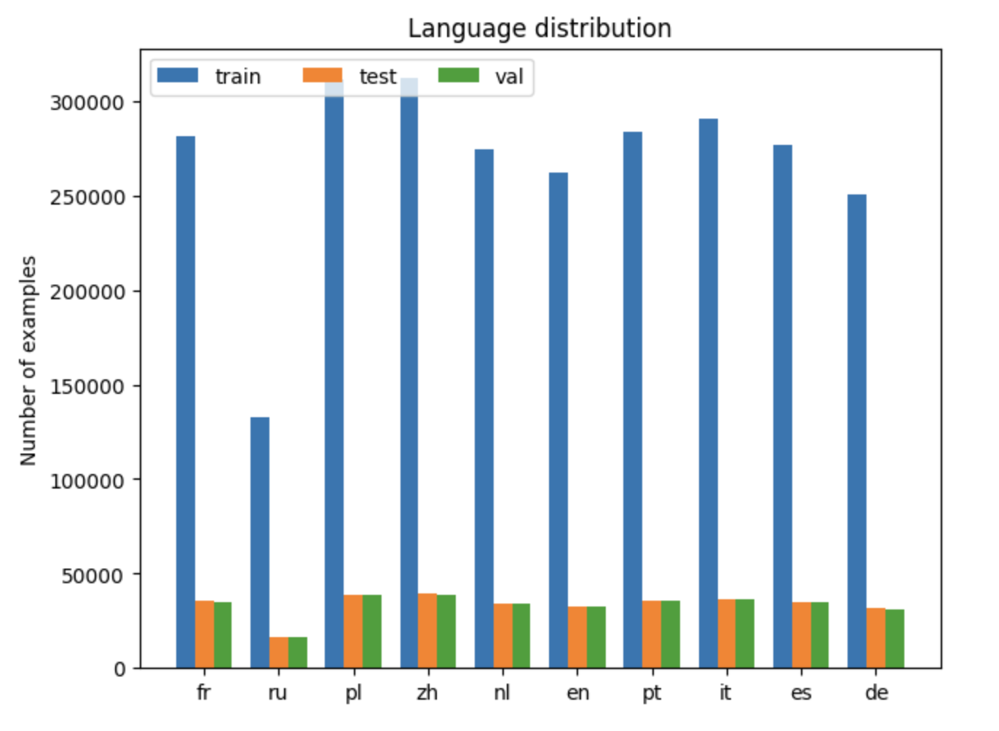
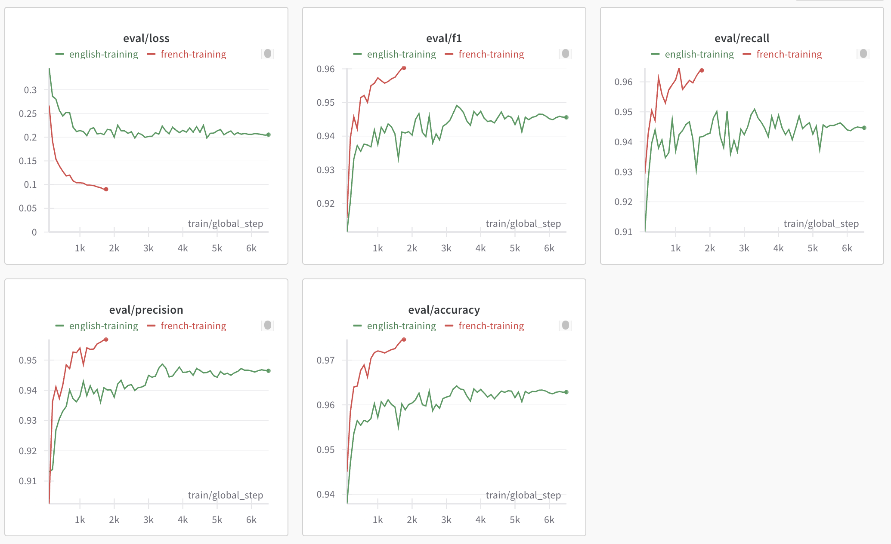
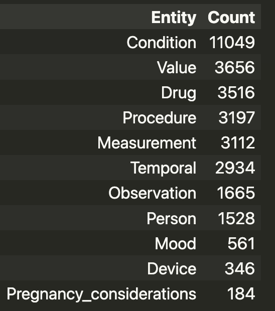
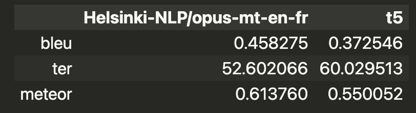
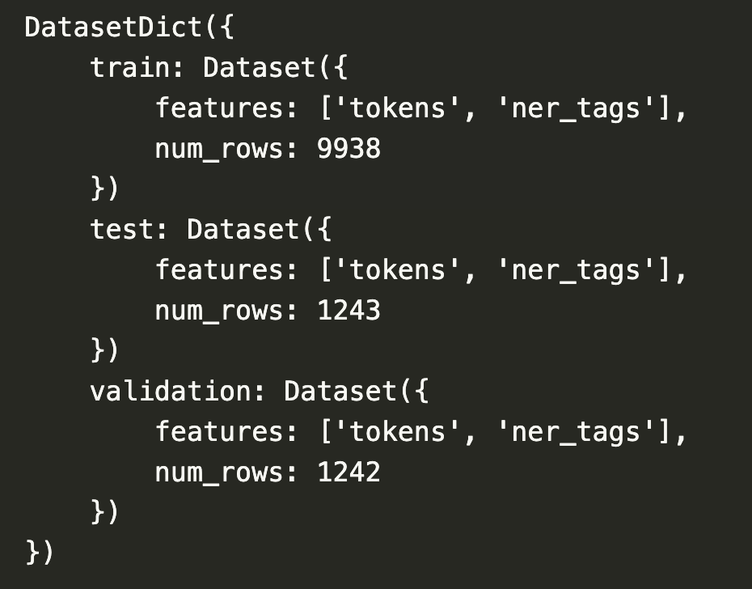
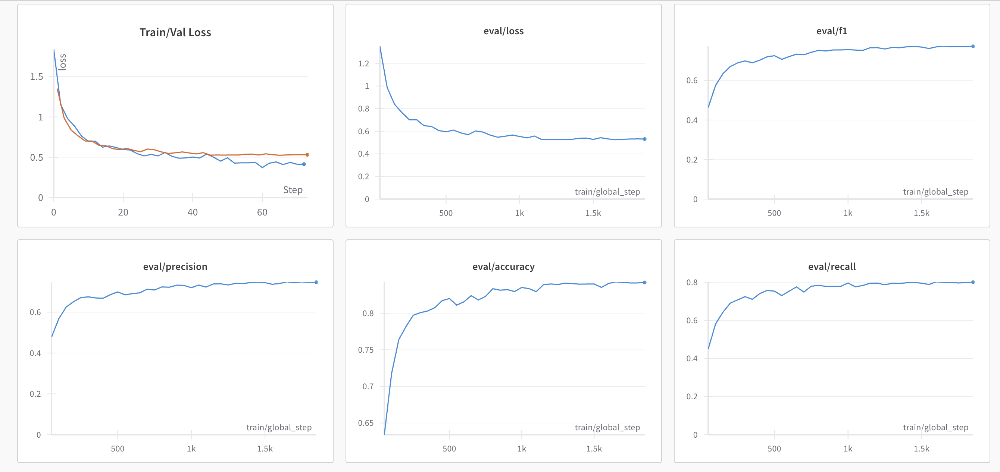
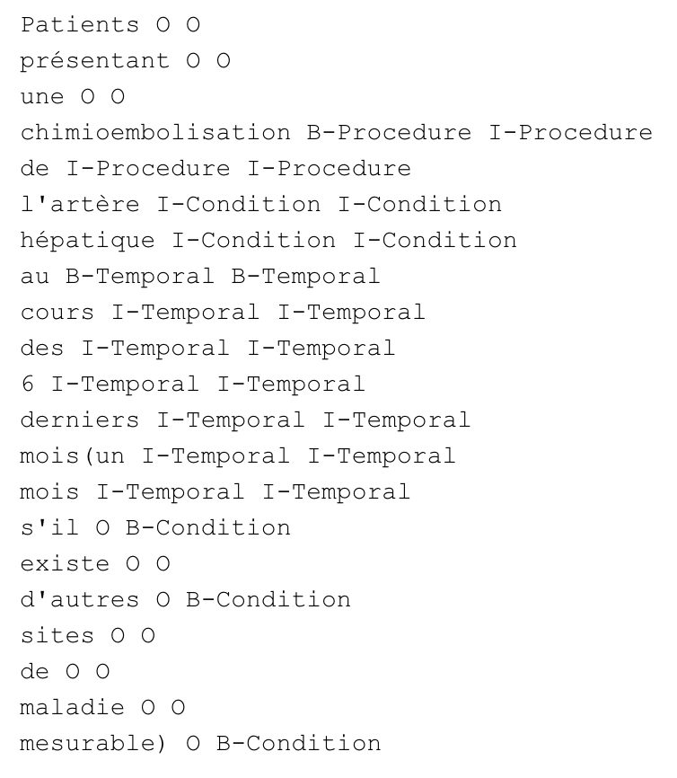

# Creation-of-a-synthetic-dataset-for-French-NER-in-clinical-trial-texts
Final project of Hands-On NLP course at Université Paris-Saclay M1-AI

**Authors:**

1. Carlos Cuevas Villarmín
2. José Felipe Espinosa Orjuela
3. Javier Alejandro Lopetegui González

*keywords:* machine translation, NER, multilingual, medical trials
### Introduction:

The objective of this work is to create a dataset in French for Named Entity Recognition (NER) in the context of medical trials eligibility criteria. We are going to use a cross-lingual approach to make it possible based on the idea from this [blog](https://pradeepundefned.medium.com/how-to-do-named-entity-recognition-for-languages-other-than-english-bac58898ad33).

As starting point we are going to use a dataset built from the original [CHIA dataset](https://figshare.com/articles/dataset/Chia_Annotated_Datasets/11855817) but just considering non-overlaping entities. This dataset is annotated in [BIO](https://en.wikipedia.org/wiki/Inside%E2%80%93outside%E2%80%93beginning_(tagging)) format. Then, the process for creating this French version of the dataset consists in:

1. Translate sentences from English to French using a Neural Machine Translation (NMT) model.
2. Fine-tune a transformers-based multilingual model for NER over the English version of the corpus.
3. Use the fine-tuned model in English data to annotate the sentences in French.

In order to validate this pipeline for French annotations we are going to evaluate the performance of the selected model over a dataset already annotated in English and French: [multiNERD](https://huggingface.co/datasets/Babelscape/multinerd). As in our pipeline, we are going to train the model in English and evaluate it using the french evaluation data.

Now we are going to explain in details the process and the results obtained.

### Model Selection for Cross-lingual NER:

For the model implementation we are going to use the huggingface version for TokenClassification of the [XLM-RoBERTa](https://huggingface.co/FacebookAI/xlm-roberta-base) model. This model is a multilingual version of [RoBERTa](https://huggingface.co/docs/transformers/model_doc/roberta). It is pre-trained on 2.5TB of filtered CommonCrawl data containing 100 languages (French and English among them).

We are able to load the model directly from hugginface as follow:

```
from transformers import AutoModelForTokenClassification, AutoTokenizer

tokenizer = AutoTokenizer.from_pretrained('xlm-roberta-base')
model = AutoModelForTokenClassification.from_pretrained('xlm-roberta-base', num_labels=len(label_list), label2id=labels_vocab, id2label=labels_vocab_reverse)
```

where the rest of the inputs are going to be explained afterward.

### Tokenizer considerations:

As we can see in the previous section we used the **xlm-roberta-base** tokeinzer. This is a *subwords* tokeinzer what means that it can split words into several subwords (tokens) during the tokenization process. In the context of NER it creates a difficulty for dealing with labels annotation for subwords. In our implementation we contemplate two possibilities considering **l** as the entity of the word associated with the main entity **LABEL**:

1. Assign to the first subword the entity **l** and the **I-LABEL** entity for the rest.
2. Assign **l** to every subword.
3. Assign **l** to the first subword and **-100** for the rest, being this a label for special tokens.

The method for tokenization and entities-alignment is:

```
def tokenize_and_align_labels(sentence, flag = 'I'):
    """
    Tokenize the sentence and align the labels
    inputs:
        sentence: dict, the sentence from the dataset
        flag: str, the flag to indicate how to deal with the labels for subwords
            - 'I': use the label of the first subword for all subwords but as intermediate (I-ENT)
            - 'B': use the label of the first subword for all subwords as beginning (B-ENT)
            - None: use -100 for subwords
    outputs:
        tokenized_sentence: dict, the tokenized sentence now with a field for the labels
    """
    tokenized_sentence = tokenizer(sentence['tokens'], is_split_into_words=True, truncation=True)

    labels = []
    for i, labels_s in enumerate(sentence['ner_tags']):
        word_ids = tokenized_sentence.word_ids(batch_index=i)
        previous_word_idx = None
        label_ids = []
        for word_idx in word_ids:
            # if the word_idx is None, assign -100
            if word_idx is None:
                label_ids.append(-100)
            # if it is a new word, assign the corresponding label
            elif word_idx != previous_word_idx:
                label_ids.append(labels_s[word_idx])
            # if it is the same word, check the flag to assign
            else:
                if flag == 'I':
                    if label_list[labels_s[word_idx]].startswith('I'):
                      label_ids.append(labels_s[word_idx])
                    else:
                      label_ids.append(labels_s[word_idx] + 1)
                elif flag == 'B':
                    label_ids.append(labels_s[word_idx])
                elif flag == None:
                    label_ids.append(-100)
            previous_word_idx = word_idx
        labels.append(label_ids)
    tokenized_sentence['labels'] = labels
    return tokenized_sentence
```

Once you have the annotations for the tokenized sentences the other doubt is for dealing with sentences reconstruction and label selection. In our implementation we consider selecting the label of the first subword and considering the majority among all the subwords. The annotations for both cases were considered in the final dataset creation. This method is:

```
def annotate_sentences(dataset, labels, entities_list,criteria = 'first_label'):
    """
    Annotate the sentences with the predicted labels
    inputs:
        dataset: dataset, dataset with the sentences
        labels: list, list of labels
        entities_list: list, list of entities
        criteria: str, criteria to use to select the label when the words pices have different labels
            - first_label: select the first label
            - majority: select the label with the majority
    outputs:
        annotated_sentences: list, list of annotated sentences
    """
    annotated_sentences = []
    for i in range(len(dataset)):
        # get just the tokens different from None
        sentence = dataset[i]
        word_ids = sentence['word_ids']
        sentence_labels = labels[i]
        annotated_sentence = [[] for _ in range(len(dataset[i]['tokens']))]
        for word_id, label in zip(word_ids, sentence_labels):
            if word_id is not None:
                annotated_sentence[word_id].append(label)
        annotated_sentence_filtered = []
        if criteria == 'first_label':
            annotated_sentence_filtered = [annotated_sentence[i][0] for i in range(len(annotated_sentence))]
        elif criteria == 'majority':
            annotated_sentence_filtered = [max(set(annotated_sentence[i]), key=annotated_sentence[i].count) for i in range(len(annotated_sentence))]

        annotated_sentences.append(annotated_sentence_filtered)
    return annotated_sentences
```

### NER evaluation considerations:

For the evaluation process over already annotated data we evaluated the exact annotations expected for each token (subwords considered). We evaluated the *precision, recall, accuracy* and *f1-score*. The metrics evaluation method used is:

```
def compute_metrics(p):
    predictions, labels = p
    predictions = np.argmax(predictions, axis=2)

    # Remove ignored index (special tokens)
    true_predictions = [
        [label_list[p] for (p, l) in zip(prediction, label) if l != -100]
        for prediction, label in zip(predictions, labels)
    ]
    true_labels = [
        [label_list[l] for (p, l) in zip(prediction, label) if l != -100]
        for prediction, label in zip(predictions, labels)
    ]

    results = metric.compute(predictions=true_predictions, references=true_labels)
    return {
        "precision": results["overall_precision"],
        "recall": results["overall_recall"],
        "f1": results["overall_f1"],
        "accuracy": results["overall_accuracy"],
    }
```

where we used the package [seqeval](https://pypi.org/project/seqeval/).

For the trainig loss we used the default **cross-entropy loss**.

### Evaluation of XLM-RoBERTa performance over MultiNERD dataset in the cross-lingua NER task

As we explained before, in order to validate the idea implemented for the corpus annotation we used the MultiNERD corpus. We fine-tuned the **XLM-roBERTa** model for NER using the english version of the corpus and evaluated over the French test subset. This implementation is accessible in the [multilingual_ner_model](https://github.com/jlopetegui98/Creation-of-a-synthetic-dataset-for-French-NER-in-clinical-trial-texts/blob/main/Multilingual-NER-Model/multilingual_ner_model.ipynb) notebook.

In the following image we show the distribution of languages in the dataset:



The entites used for this model are shown in the next code slice:

```
labels_vocab = {
    "O": 0,
    "B-PER": 1,
    "I-PER": 2,
    "B-ORG": 3,
    "I-ORG": 4,
    "B-LOC": 5,
    "I-LOC": 6,
    "B-ANIM": 7,
    "I-ANIM": 8,
    "B-BIO": 9,
    "I-BIO": 10,
    "B-CEL": 11,
    "I-CEL": 12,
    "B-DIS": 13,
    "I-DIS": 14,
    "B-EVE": 15,
    "I-EVE": 16,
    "B-FOOD": 17,
    "I-FOOD": 18,
    "B-INST": 19,
    "I-INST": 20,
    "B-MEDIA": 21,
    "I-MEDIA": 22,
    "B-MYTH": 23,
    "I-MYTH": 24,
    "B-PLANT": 25,
    "I-PLANT": 26,
    "B-TIME": 27,
    "I-TIME": 28,
    "B-VEHI": 29,
    "I-VEHI": 30,
}

label_list = list(labels_vocab.keys())
labels_vocab_reverse = {v:k for k,v in labels_vocab.items()}
```

Here we can see the parameters used as inputs to load the model. They are just related with the mapping between labels and its integer representation.

For training process we used the [Trainer](https://huggingface.co/docs/transformers/main_classes/trainer) class from huggingface and we used [wandb](https://wandb.ai/home) to track the training and validation metrics. The parameters used for training were defined in the following way:

```
args = TrainingArguments(
    report_to = 'wandb',
    run_name = "multinerd-multilingual-ner",
    evaluation_strategy = "steps",
    learning_rate=2e-5,
    per_device_train_batch_size=16,
    per_device_eval_batch_size=8,
    num_train_epochs=3,
    weight_decay=0.01,
    push_to_hub=False,
    eval_steps=10000,
    save_steps=10000,
)
```

The trainer instance is created as follow:

```
    trainer = Trainer(
        model,
        args,
        train_dataset=data_train,
        eval_dataset=tokenized_test_fr,
        data_collator=data_collator,
        tokenizer=tokenizer,
        compute_metrics=compute_metrics
    )
```

To be able to make a good tracking of the performance over the french data deppending on the training data, we used the French test subset as validation set for the Trainer. Then we made the training over the English training subset and a subset of the French one (available in the notebook [french_corpus_training_multilineal](https://github.com/jlopetegui98/Creation-of-a-synthetic-dataset-for-French-NER-in-clinical-trial-texts/blob/main/Multilingual-NER-Model/french_corpus_training_multinerd.ipynb)). We are going to compare the validation metrics evolution deppending on the training steps for both cases. In the following graphs you can see these metrics evolutino during both training processes. (these metrics and all the training process are reported in [wandb](https://wandb.ai/javier-lopetegui-gonzalez/Multilingual-NER-multinerd_french_tr/reports/Cross-lingual-approach-evaluation-for-NER-on-MultiNERD-dataset--Vmlldzo2OTYzNDY5))



If we compare the results obtained after training just in english with the results obtained after training with a subset of french data we can see that even when of course the performance is better in the second case, for the cross-lingual approach it is still really good. In the graphs shown before we can see clearly that in both cases the model is *learning* to solve the task of NER on French. This is a powerfull result because it opens a lot of possibilities for dealing with NER in many languages. Firstly, you will be able to obtain decent results even without training at all in the target language for the specific task. But also it makes it possible to deal with small datasets in the target language. You can first train the model in a more represented language for the task (commonly english) and then fine-tune over the small dataset and you will obtain very good results.

Then, now we are able to focus in our specific task.


### Brief description of CHIA dataset used

As stated in the introductory section, we are going to work in a dataset obtained from [CHIA](https://figshare.com/articles/dataset/Chia_Annotated_Datasets/11855817) dataset. The original annotated dataset consists of eligibility criteria data from 1000 clinical trials. For each trial the dataset have two files, one with the inclusion criteria (Ex: *NCT00050349_exc*) and one with exclusion criteria (Ex: *NCT00050349_exc*). Originally it have entities and relations but we are going to focus in a subset of the entities and not in relations. From the original entities we are going to focus on a subset of not overlapping entities following the work made in the paper [Transformer-Based Named Entity Recognition for Parsing Clinical Trial Eligibility Criteria](https://www.ncbi.nlm.nih.gov/pmc/articles/PMC8373041/).

Then, the dataset we are working with is annotated in [BIO](https://en.wikipedia.org/wiki/Inside%E2%80%93outside%E2%80%93beginning_(tagging)) format. The distribution of the main entities (considering B-Label and I-Label just as one Label repetition) is the following:



We can nottice that there are three labels: *Mood, Device* and *Pregnancy_consideration* which are underrepresented compared with the rest. Then, we decided for the scope of this work to focus just in the entities with more than 1000 examples, what left us with:

```
sel_ent = {
    "O": 0,
    "B-Condition": 1,
    "I-Condition": 2,
    "B-Value": 3,
    "I-Value": 4,
    "B-Drug": 5,
    "I-Drug": 6,
    "B-Procedure": 7,
    "I-Procedure": 8,
    "B-Measurement": 9,
    "I-Measurement": 10,
    "B-Temporal": 11,
    "I-Temporal": 12,
    "B-Observation": 13,
    "I-Observation": 14,
    "B-Person": 15,
    "I-Person": 16
}
entities_list = list(sel_ent.keys())
sel_ent_inv = {v: k for k, v in sel_ent.items()}
```

### CHIA-dataset sentences translation

For the sentences translation we used the hugginface [Translation Pipeline](https://huggingface.co/docs/transformers/en/main_classes/pipelines) and particularly the model [Helsinki-NLP/opus-mt-en-fr](https://huggingface.co/Helsinki-NLP/opus-mt-en-fr) from the [Helsinki-NLP](https://huggingface.co/Helsinki-NLP) family.

The main code for the translation is:

```
translator = pipeline("translation", model="Helsinki-NLP/opus-mt-en-fr", device = 0)

# translate the sentences
for file in tqdm(files):
    with open(f'{data_path}/chia_criteria_texts/{file}', 'r') as f:
        file_text = f.read()
    sentences = file_text.split('\n')
    sentences = [s for s in sentences if s if len(s) > 0 and len(s.split()) < 512]
    translated_sentences = translator(sentences)
    with open(f'{data_path}/chia_criteria_french/{file.replace(".txt", "_fr.txt")}', 'w') as f:
        f.write('\n'.join([t['translation_text'] for t in translated_sentences]))
```

The entire translation code is available in the notebook [translation_model](https://github.com/jlopetegui98/Creation-of-a-synthetic-dataset-for-French-NER-in-clinical-trial-texts/blob/main/TranslationModel/translation_model.ipynb).

### Evaluating Translation

To evaluate the translation model that we used, we used the [BLEU-score](https://huggingface.co/spaces/evaluate-metric/bleu), [TER](https://huggingface.co/spaces/evaluate-metric/ter) and [Meteor](https://huggingface.co/spaces/evaluate-metric/meteor) metrics. The code for evaluation process is available in the notebook [evaluate_translation](https://github.com/jlopetegui98/Creation-of-a-synthetic-dataset-for-French-NER-in-clinical-trial-texts/blob/main/TranslationModel/evaluate_translation.ipynb) As reference for these metrics evaluation we used a subset of 100 trials and we translated them using [GPT-4](https://arxiv.org/abs/2303.08774) paid version. Then, over the same subset of trials we made translations using [T5](https://huggingface.co/google-t5/t5-base) model available in hugginface for translation. We decided to use this models as it is a similar moder with respect to the one we used.

Then, we obtained the following results:



As we can see, the the model [Helsinki-NLP/opus-mt-en-fr](https://huggingface.co/Helsinki-NLP/opus-mt-en-fr) has better results for all the evaluated metrics.

### Training XLM-RoBERTa model over english CHIA dataset

The next step in the process was to fine-tune **XLM-RoBERTa** over the English annotated data in the used **CHIA** dataset. The code for the training is available in the notebook [model_ner_chia](https://github.com/jlopetegui98/Creation-of-a-synthetic-dataset-for-French-NER-in-clinical-trial-texts/blob/main/NER-chia-dataset/model_ner_chia.ipynb). 

For the training and validation process we splitted the available dataset into *training, validation* and *test* subsets as we can see in the following code:

```
    chia_eng_train_test = chia_eng_dataset.train_test_split(test_size=0.2)
    chia_eng_test_val = chia_eng_train_test["test"].train_test_split(test_size=0.5)
    chia_eng_dataset = DatasetDict({
        "train": chia_eng_train_test["train"],
        "test": chia_eng_test_val["test"],
        "validation": chia_eng_test_val["train"]
    })
```

After the splitting we got the following distribution for the dataset:



The training process was similar as for **MultiNERD** dataset case. We used the same huggingface [Trainer](https://huggingface.co/docs/transformers/main_classes/trainer) class. The arguments for trainig were:

```
# define the training arguments
args = TrainingArguments(
    report_to = 'wandb',
    run_name = 'chia_multilingual_ner',
    evaluation_strategy = "steps",
    learning_rate=2e-5,
    per_device_train_batch_size=16,
    per_device_eval_batch_size=8,
    num_train_epochs=3,
    weight_decay=0.01,
    logging_steps=50,
    overwrite_output_dir = True,
    eval_steps=50,
    save_steps=1000,
    output_dir = 'chia_multilingual_ner'
)
```

Then, the definition of the trainer instance was:

```
# define the trainer
trainer = Trainer(
    model,
    args,
    train_dataset=chia_eng_dataset["train"],
    eval_dataset=chia_eng_dataset["validation"],
    data_collator=data_collator,
    tokenizer=tokenizer,
    compute_metrics=compute_metrics
)
```

After three epochs of trining we obtained the following learning curves (the complete report is available in [wandb](https://wandb.ai/javier-lopetegui-gonzalez/Multilingual-NER-Chia_dataset/reports/NER-Chia-dataset-training--Vmlldzo2OTQxNDA5)):



The results obtained over the English dataset are in the order we were expecting if we take into account the results reported for this dataset previously in the literature, particularly in the paper [Transformer-Based Named Entity Recognition for Parsing Clinical Trial Eligibility Criteria](https://www.ncbi.nlm.nih.gov/pmc/articles/PMC8373041/).

### French-CHIA dataset annotation

Then, once we trained the model over the English version of the dataset, we were ready to go to the main point of our work: the annotations over French sentences. The code for this process is available in the notebook [annotate_french_corpus](https://github.com/jlopetegui98/Creation-of-a-synthetic-dataset-for-French-NER-in-clinical-trial-texts/blob/main/NER-chia-dataset/annotate_french_corpus.ipynb).

For doing the annotations we used the same tokenizer explained before for **XLM-RoBERTa** and the model obtained after fine-tuning on English annotations:

```
    # load model
    model = torch.load(f'{models_path}/chia-multilingual-ner.pt')
    # load tokenizer
    tokenizer = AutoTokenizer.from_pretrained(base_model)
```

For each sentence in the dataset we got the sepparated words (just considering at the beggining the space separations) and the file they came from as its name is related with the original crilinal trial associated:

```
    for file, sentence in sentences:
        data_french.append({
            'tokens': sentence.split(),
            'file': file
        })
    data_french = Dataset.from_pandas(pd.DataFrame(data_french))
```

For tokenization process we considered important to keep the word_ids for the recovery of the original sentences after the annotations. Then, we applied the following method over the entire dataset:

```
    def tokenize_sentence(sentence, tokenizer):
        """
        Tokenize a sentence using the tokenizer and keeps the word ids
        inputs:
            sentence: str, sentence to tokenize
            tokenizer: tokenizer, tokenizer to use
        outputs:
            tokenized_sentence: dict, tokenized sentence
        """
        tokenized_sentence = tokenizer(sentence, is_split_into_words=True, truncation=True, padding='max_length', max_length=512)
        words_ids  = []
        for i in range(len(sentence)):
            word_ids_sentence = tokenized_sentence.word_ids(batch_index=i)
            words_ids.append(word_ids_sentence)
        tokenized_sentence['word_ids'] = words_ids
        return tokenized_sentence
```

We used a DataLoader instance for doing the annotations using batches of $size=16$ as defined in the next line:

```
    data_loader = torch.utils.data.DataLoader(data, batch_size=16)
```

Then we made the annotations using the loaded model as follow:

```
    labels = []
    for batch in tqdm(data_loader):

        batch['input_ids'] = torch.LongTensor(np.column_stack(np.array(batch['input_ids']))).to(device)
        batch['attention_mask'] = torch.LongTensor(np.column_stack(np.array(batch['attention_mask']))).to(device)
        batch_tokenizer = {'input_ids': batch['input_ids'], 'attention_mask': batch['attention_mask']}
        # break
        with torch.no_grad():
            outputs = model(**batch_tokenizer)

        labels_batch = torch.argmax(outputs.logits, dim=2).to('cpu').numpy()
        labels.extend([list(labels_batch[i]) for i in range(labels_batch.shape[0])])

        del batch
        del outputs
        torch.cuda.empty_cache()
```

We got the tokenizer *inputs_id* and *attention_mask* for each batch and passed them as input for the model. Then, we got the softmax output and got the maximum value for each token among all the possible entities. 

After that, we used the method **annotate_sentences** explained in the tokenizer section of this document to annotated the original sentences following the ideas explained before. After that, we created the corresponding dataset instance:

```
    Dataset({
        features: ['tokens', 'annotated_labels', 'annotated_labels_max', 'file'],
        num_rows: 12423
    })
```

Finally we uploaded the dataset to hugginface and it is available in [chia-ner-french](https://huggingface.co/datasets/JavierLopetegui/chia-ner-french).

Now we are going to present some of the final annotations:


Probar.


Probar.



### Further work

We consider that to improve what we have done we should make an evaluation process for the annotations. We want to perform human annotations over a subset of the sentences and then evaluate the usual metrics on the model annotations. Furthermore, using this human annotations to fine-tune the English trained model could also lead to more accurately annotations.

On the other hand, for the translation process, using a more complex model such as modern **LLM** as *Mistral7-B*, *Llama* or other open-source models would improve the results.
